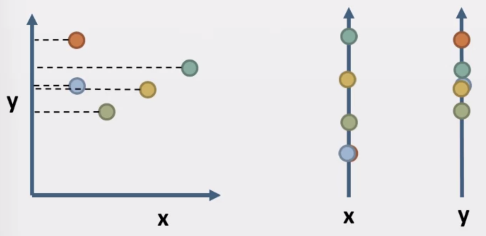

# Data Visualization - University of Illinois

## Week 2 - Visualization of Numerical Data

## Data, Mapping, and Charts

- Data
  - Data Visualization Framework
    - First, Data is available from a variety of sources.
    - Then, there is a data collection operation. That combines the data from different sources and processes it into one package for visualization.
    - After this, there is the mapping process, using a mapping layer, which takes the data and the data's abstract and or other computational representation.
    - Finally, a graphics layer use this and display this representation.
  - A comparison of the layers below

| Data Layer                              | Mapping Layer                                                     | Graphics Layer                                |
| --------------------------------------- | ----------------------------------------------------------------- | --------------------------------------------- |
| Locating and obtaining data             | Associating appropriate geometry with corresponding data channels | Conversion of geometry into displayable image |
| Importing data in proper format         | Data analysis and algorithms (E.g contouring)                     | Decorations                                   |
| Relating data for proper correspondence |                                                                   | Managing interaction                          |
| Data analysis and aggregation           |                                                                   |                                               |

- Data Types

|                                       |                  Discrete (no between values)                  |       Continuous (values between)       |
|:-------------------------------------:|:--------------------------------------------------------------:|:--------------------------------------:|
|    Ordered (values are comparable)    | Ordinal (E.g. Sizes S,M,L,XL) Counts (E.g. Counts 1,2,3) |   Fields (E.g. Altitude, Temperature)  |
| Unordered (values are not comparable) |      Nominal (E.g. Shapes) Categories (E.g. Nationalities)     | Cyclic values (E.g. Directions, Hues)  |

- Data as Variables

|        Science       | Databases | Data Warehouses |
|:--------------------:|:---------:|:---------------:|
| Independent Variable |    Key    |    Dimension    |
|  Dependent Variable  |   Value   |     Measure     |

- Mapping
  - When we map the data, it is converted into a primitive graphic that could be displayed.
  - This is dependent on how different objects are perceived and how to connect its characteristics with the data characteristics.
  - Some studies showed how different geometric mappings are more effective.
  - Mapping Quantitative Values
    - Using Position, Length, Angle/Slope (Pie Chart)are really effective. (1D)
    - Using area can be effective (2D)
    - Using Volume and Color/Density are normally not good and can confuse your visualization (3D)
  - Mapping Ordinal Data
    - Position still is really good
    - Density, Saturation and Hue are good in this situation
    - New representations here emerge as good in specific situations, like: Textures, Connections and Containment.
    - The rest, isn't really effective. Especially Slope, Area and Volume.
  - Mapping Nominal Data
    - Position still the strongest.
    - Hue, Texture. Connections, Containment improve in this category to visualize data.
    - Density, Saturation and shape can be use to describe special visualizations
    - The rest, still, not very effective.
- Charts
  - The success of a data visualization often depend on how we map our data variables to the elements on charts.
  - Bar Chart
    - Normally has two axis. A quantitative dependent variable (Measure) on the y-axis and a Nominal/Discrete independent (Category, Quantitative, Ordinal) variable on the x-axis.
    - Benefits from the position (height of the bar) and the length (size of the bar)
  - Line Chart
    - Needs continuous variables on the x-axis (independent) and the y-axis (dependent). Like measures.
    - Benefits from position but not from length
    - Displaying a function.
  - Scatter Plot
    - Needs continuous variables on the x-axis (independent) and the y-axis (independent). Like measures.
    - Relies on position, and sometimes clustering.
  - Gantt Chart
    - Used not with functions, but with processes.
    - In the y-axis it uses a Discrete/nominal independent variable (Categorical) and in the x-axis a quantitative independent variable.
    - Categorical.
  - Table
    - Both axis are Discrete/nominal independent variables.
    - Benefits from position only.
  - But what to use?

||Independent Nominal/Quantitative Discrete Variables (Categories: Sizes, forms, nationality, places) | Independent Quantitative Continuous Variables (A fundamental continuous dimension, time, speed) |
|:------------------------------------------------------------------------------------------------------------:|:---------------------------------------------------------------------------------------------------:|:-----------------------------------------------------------------------------------------------:|
| Dependent Quantitative Continuous Variables (Cientific Measures (as a function of Altitude), Continous Data) |                                                 Bar                                                 |                                               Line                                              |
|                      Dependent Quantitative Discrete Variables (Population, GDP, Counts)                     |                                                 Bar                                                 |                                               Bar                                               |
|        Independent Quantitative Continuous Variables (A fundamental continuous dimension, time, speed)       |                                                Gantt                                                |                                             Scatter                                             |
|      Independent Nominal/Quantitative Discrete Variables (Categories: Sizes, forms, nationality, places)     |                                                Table                                                |                                              Gantt                                              |

----

## Glyphs, Parallel Coordinates & Stacked Graphs

- Glyphs
  - The Glyph is the shape in a part of a chart.
  - In bar shape charts, the top of bar charts, start/end of Gantt charts and the bar shape.
  - The shape of points in line charts and scatter plots.
  - Table is a scatter plot of regular variables.
  - Can vary in shape, color, size.
  - We can use mapping with the glyphs. And combine multiple maps to give glyphs meaning.
  - We can use glyphs to represent more than just data. It can be used to represent variants. Like Error Bars.
  - Even in tables, we can use glyphs like colours to indicate values.
  - It's possible to use glyphs to do high dimension visualization data, like each one is a plot itself.
  - Chernoff faces. Use drawn face characteristics to plot features.

- Parallel Coordinates
  - Parallel Coordinates offer ways to plot higher dimensional spaces than is usually possible.
  - Imagine a scatter plot. With the X and Y axis. Break them and drag the points to the projection of those two axis.
  
  - Draw a line to each correspondent point.
  - It helps to notice if the points are collinear.
  - Do this with every dimension, and you have the following image.
 
  - You can notice that these points can converge as seen to z and w, to notice future convergence.
  - It needs some work to find the best combination to use to visualize data or features in data.
- Stacked Graphs
  - In stacked bar chart, the central limit theorem explains that as more bars are added, the sums will vary less.
  - In Pie Charts can be degraded if use 3D, because of perspective.
  - Stacking Order Matters!
  - Diverging Stacked Bar Charts, 
  - If is needed to stack 3 graphs, is better to use stacked line graphs.
  - In a stacked graph layout it is noticeable the effect in the higher parts of the graph being harder to measure the change than the lower part.
  - We can use the ThemeRiver Layout to try to correct the variation reseting the center of the graph. Using g0 = -1/2 (sum of all functions) and minimizes the girth of the chart and the top and the bottom slopes.
  - It is possible to use Streamgraph layout using g0 = - 1 / n + 1 times the (sum for each functuion with [ ( n - i + 1) fi ] ).
  - Minimizes deviantion and "wiggle".
  - Changing the order of Streamgraph functions helps even more to notice each function pattern and visualization.

----

## Tufte's Design Rules & Using Color

- Tufte's Design Rules
  - Let the Data Speak
  - A picture is worth a thousand words
  - Annotation (Label your Axis)
  - Avoid Chartjunk
  - Data-Ink Ratio (Maximize ratio of data to ink in your visualization)
  - Micro/Macro. (Use micro detail at macro level. Zoomable interfaces)
  - Information Layers
  - Multiples (Consistent Design)
  - Narrative
  - Color

- Color
  - Is important to use color to trigger perceptual cues and help sensing the data.
  - Think about color in the more natural set of components.
  - Hue, Saturation, Value.
  - Saturation is how intense the color is.
  - Value is how bright a color is, the distance from black.
  - Hues
    - Observers can rapidly differentiate between only five to ten hues.
    - Twelve colors (6 + 6) recommended by Ward's "Information Visualization"
  - Saturation
    - Use saturation in points, strokes and symbols
    - Avoid saturation in fills or larger areas
  - Contrast
    - Use higher luminance contrast to gain attention
    - Make sure text has sufficient luminance contrast
  - Use colors for ordinal values and Hue for categories.
  - Color maps for quantitative values. It can be problematic, can be influence light in 3d maps.
  - http://colorbrewer2.org/
