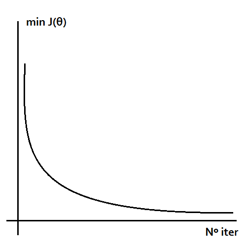
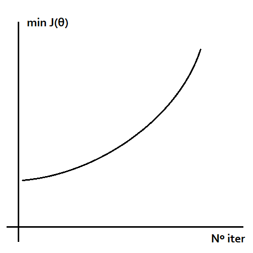
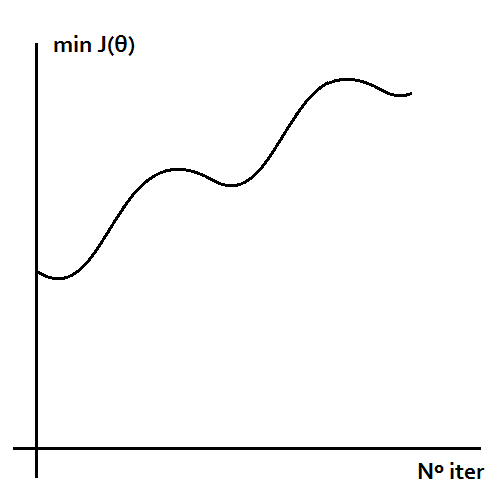
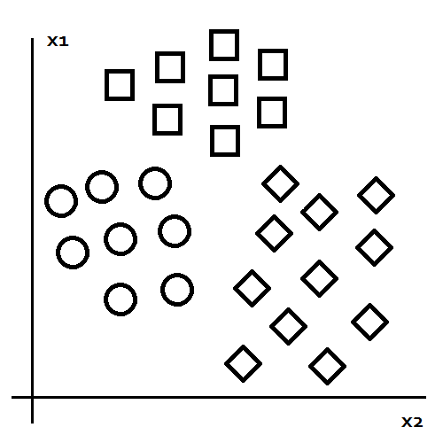
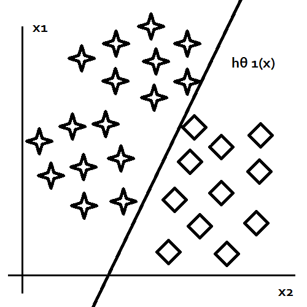
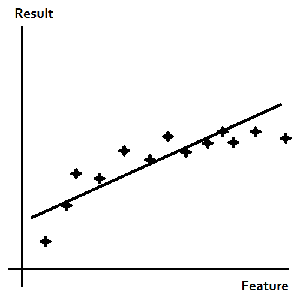
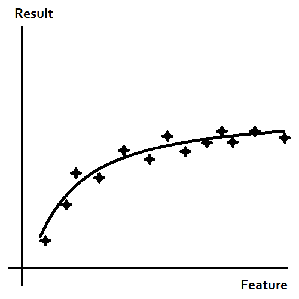
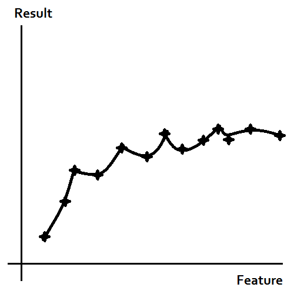

# Machine Learning - Andrew NG

---

Summary Author: Pablo Nunes.

This is a personal summary of [Andrew NG's course](https://www.coursera.org/learn/machine-learning) at Stanford University provided by Coursera.

---

## Table of Contents

**1. [Week 1 - Intro](#week-1---intro)**

- [What is Machine Learning?](#what-is-machine-learning)
- [Machine Learning Algorithms Outlook](#machine-learning-algorithms-outlook)
- [Supervised Learning Basis](#supervised-learning-basis)
- [Unsupervised Learning Basis](#unsupervised-learning-basis)
- [Linear Regression with One Variable](#linear-regression-with-one-variable)  
  - [What is Linear Regression?](#what-is-linear-regression)
  - [Gradient Descent](#gradient-descent)

**2. [Week 2 - Linear Regression](#week-2---linear-regression)**

- [Multiple Features](#multiple-features)
- [Gradient Descent for Multiple Features](#gradient-descent-for-multiple-features)
- [Gradient Descent in Practice](#gradient-descent-in-practice)
  - [Feature Scaling](#feature-scaling)
  - [Mean normalization](#mean-normalization)
  - [Debugging](#debugging)
- [Features and polynomial regression](#features-and-polynomial-regression)
- [Computing Parameters Analytically (Normal Equation)](#computing-parameters-analytically)

**3. [Week 3 - Logistic Regression & Regularization](#week-3---logistic-regression--regularization)**

  - [Logistic Regression](#logistic-regression)
      - [What is classification?](#what-is-classification)
      - [Hypothesis Representation](#hypothesis-representation)
      - [Decision boundary](#decision-boundary)
      - [Advanced Optimization](#advanced-optimization)
      - [Multiclass Classification](#multiclass-classification)
  - [Regularization](#regularization)
    - [What is overfitting?](#what-is-overfitting)
    - [Addressing Overfitting](#addressing-overfitting)
    - [Cost Function - Overfitting](#cost-function---overfitting)
      - [Regularized Linear Regression](#regularized-linear-regression)
      - [Gradient Descent - Regularized Linear Regression](#gradient-descent---regularized-linear-regression)
      - [Normal Equation - Regularized Linear Regression](#normal-equation---regularized-linear-regression)
    - [Regularized logistic regularization](#regularized-logistic-regularization)
      - [Gradient Descent - Regularized Logistic Regression](#gradient-descent---regularized-logistic-regression)
      - [Cost Function - Regularized Logistic Regression](#cost-function---regularized-logistic-regression)

**4. [Week 4 - Neural Networks - Representation](#week-4---neural-networks---representation)**

**5. [Week 5 - Neural Networks - Learning](#week-5---neural-networks---learning)**

**6. [Week 6 - Machine Learning Advice & ML System Design](#week-6---machine-learning-advice--ml-system-design)**

**7. [Week 7 -  Support Vector Machines](#week-7---support-vector-machines)**

**8. [Week 8 - Unsupervised Learning & Dimensionality Reduction](#week-8---unsupervised-learning--dimensionality-reduction)**

**9. [Week 9 - Anomaly Detection & Recommender Systems](#week-9---anomaly-detection--recommender-systems)**

**10. [Week 10 - Large Scale Machine Learning](#week-10---large-scale-machine-learning)**

**11. [Week 11 - OCR Application](#week-11---ocr-application)**

---

## **Week 1 - Intro**

### What is Machine Learning?

According to **Arthur Samuel**:

- Is a field of study, which gives computers the ability to learn, without being explicitly programmed.

According to **Tom Michell**:

- A computer is said to learn:

  - From experience E
  - Some task T
  - Some performance P
  - It's performance on T, measured by P, improves with experience E.

### Machine Learning Algorithms Outlook

- Supervised Learning
- Not Supervised Learning
- Reinforcement Learning
- Recommender Systems

### Supervised Learning Basis

- Regression x Classification
- We give a dataset of data and we know the output

### Unsupervised Learning Basis

- We do not know a lot about the data
- The algorithm will try to find the structure.

### Linear Regression with One Variable

- #### What is Linear Regression?

  - Linear Regression is the problem which with previous data we try to formulate a function, and with this mathematical mechanism, try to predict some numerical value. This numerical value can have a large range.
  - To measure the accuracy of the hypothesis this formulation creates, we need a cost function.
  - We will try to fit the data to a simple formula:

    $y = \theta_{0} + \theta_{1}*x$

  - In this formula we have:
  
    - $y$ : The prediction
    - $\theta_{0}$ : The bias, which makes our predictions having a bias towards predictions according to the training data. Important to be turned correctly.
    - $\theta_{1}$ : The weights, which takes our inputs and use them together to make predictions.

  - The formula for the Squared Error Function Error, based on the training set is:
  
     $J(\theta_{0},\theta_{1}) = \min_{\theta_{0},\theta_{1}}\frac{1}{2m}\sum_{i = 1}^{m}(h_{\theta}(x^{(i)})) - y^{(i)}))^2$

  - In this formula we have:
    - $m$ : All the training samples.
    - $i$ : The iter in the training samples

- #### Gradient Descent

  - The problem: To minimize the cost, to make accurate predictions in the training set and improving the algorithm as a whole.
  - This means:

    $\min_{\theta_{0},\theta_{1}}J(\theta_{0},\theta_{1})$
  
  - To accomplish this objective, we have to change both $\theta_{0}$ and $\theta_{1}$, repeat this step until we get the minimum cost.
  - Algorithm:
  
    $\theta_{j} = \theta_{j} - \alpha\frac{\partial}{\partial\theta_{j}}$

  - In this formula we have:
    - $\theta_{j}$ : $j$ can be 0 or 1, it means what are we changing, the bias or the weight.
    - $\alpha$ : Learning rate, the learning rate is the speed to change certain feature, it serves to regulate the speed of learning. Putting too high can affect the algorithm accuracy, even make it diverge.

---

## Week 2 - Multiple linear Regression

### Multiple Features

- Normally, we don't have only one feature to predict something in our data. We have a large number of features to predict something.
- Hypothesis:
  - By the last formula, we would have:
  
    $h_{\theta}(x) = \theta_{0} + \theta_{1}*x_{1} + \theta_{2}*x_{2} + ... + \theta_{n}*x_{n}$
  - We could change the formula to use Matrices and be more efficient. Imagine if $x$ and $\theta$ could be rearranged as matrices! Being $n$ the number of features.

    $\theta = [\theta_{0}, \theta_{1}, \theta_{2}, ..., \theta_{n}]$

    $x = [x_{0}, x_{1}, x_{2}, ..., x_{n}]$

    We know $x \in \reals_{n+1}$ and $\theta \in \reals_{n+1}$. Remembering, $x_0$ is 1, $\theta_0$ is the bias!!

    $h_{\theta}(x) = \theta^Tx$

### Gradient Descent for multiple features

- We can use the old cost function and apply it adapting to use each feature. Remember,  $m$ is the size of training examples and $n$ is the number of features!
  
  $J(\theta_{0},\theta_{1},\theta_{2},...,\theta_{n}) = \frac{1}{2m}\sum_{i = 1}^{m}(h_{\theta}(x^{(i)})) - y^{(i)}))^2$

- Applying it to the gradient descent formula! For each feature $j$.
  
    $\theta_{j} = \theta_{j} + \alpha\frac{\partial}{\partial\theta_{j}}J(\theta_{0},\theta_{1},\theta_{2},...,\theta_{n})$

  - Calculating the partial, we have:

   $\theta_{j} = \theta_{j} + \alpha\sum_{i = 1}^{m}(h_{\theta}(x^{(i)})-y^{(i)})x_j^{(i)}$

### Gradient Descent in Practice

- #### **Feature Scaling**
  
  - Make all the features fit in a similar scale.
  - Tip: Make all the features to fit on a easy to understand scale:
  
    $x_1 = size/1000$ or $x_2 = width/10$

- #### **Mean normalization**

  - Replace $x_i$ with $x_i - \mu_i$ to make features to have approximately 0 mean.
  - Applying both, in general, every feature uses this preprocessing.
  
    $x_i = \frac{x_i - \mu_i}{\max(x_i) - \min{x_i}}$
- **Why do both?**: This helps our gradient to converge faster to a minimum!
  
- #### **Debugging**
  
  - What: Debugging helps us make sure the gradient is working correctly! It is implemented by plotting the cost function to the number of iterations.
  - How it should show:
  
    

  - Tip: Declare convergence if $J(\theta)$ decreases less than $10^-3$ in one iteration. This is our stop point, it's our $\epsilon$.
  - Tip: If your debugging looks like these. Your $\alpha$ is really big and you may have to decrease it.
  
    
    

  - Tip: Try a range of $\alpha$ to see which fit best in your algorithm!
  
    $\alpha = [0.001, 0.003, 0.01, 0.03, 0.1, 0.3, 1, 3]$

### Features and polynomial regression

- Remember, you can create features and use polynomial regression to fit better your data and to predict reality better.
- **How to use polynomial functions in regression**:
  - Imagine a normal regression:
  
    $h_{\theta}(x) = \theta_0 + \theta_1*x_1 + \theta_2*x_2 + \theta_3*x_3$
  - Now change $x$ for the following.
  
    $x_1 = a, x_2 = a^2, x_3 = a^3$

  - Remember, if you do this, **scale** your values! Use functions to fit your data!

### Computing Parameters Analytically

- Normal equation:
  - It's a method to solve for $\theta$, without needing various iterations or getting stuck in a local minimum. But very expensive computationally!
  - Using the Normal equation!
  
  $\theta \in \reals^{n+1}$

  $\theta = (X^tX)^{-1}(X^tY)$

  - It uses the Least Squares method. Gradient Descent has the advantage to not needing to compute the inverted matrix!

---

## Week 3 - Logistic Regression & Regularization

### Logistic Regression

#### What is classification?

- Is a class of problems which have to put the input in some class.
- Example: Email vs. Spam.

#### Hypothesis Representation

- The logistic regression model wants a function that can qualify a input to a 0 or a 1. ($0 \le h_{\theta(x)} \le 1$)
- Using the logistic function, we can the following:
  
  $h_{\theta}(x) = \frac{1}{1+e^{-\theta^{t}x}}$

#### Decision boundary

- The parameters of $h_{\theta}$ define our boundary
  
- ##### **Cost Function of Logistic Regression**

  - The cost function can be described as:
  
    $J(\theta) = -\frac{1}{m}[\sum^m_{i = 1}y^{(i)}\log(h_{\theta}(x^{(i)})) + (1 - y^{(i)})\log(1 - h_{\theta}(x^{(i)})]$
  
  - Our objective is trying to fit

    $min_{\theta}J(\theta)$

- ##### **Gradient Descent of Logistic Regression**

  - We can compute the $\theta$ in two ways:
    - Iterating the dataset
    - Using normal equation
  - Iterating the dataset
    - For each feature $j$:

      $\theta_j = \theta_j - \alpha\sum_{i = 1}^{m}(h_{\theta}(x^{(i)} - y^{(i)})x_j^{(i)})$

  - Using normal equation
    - With the normal equation the formula is:

      $\theta = \theta - \frac{\alpha}{m}X^T(g(X\theta)-Y)$

#### Advanced Optimization

- There are other algorithms to optimize $\theta$. Some of them are.
  - Conjugate Gradient
  - BFGS
  - L-BFGS
  
- Advantages vs. Disadvantages

| Advantages                   |   Disadvantages |
| :--------------------------- | --------------: |
| No need to pick $\alpha$     |    More complex |
| Faster than gradient descent | --------------- |

- You can try libraries to see how fast it can train and see if converges faster. You don't need to implement these methods nowadays.

#### Multiclass Classification

- Imagine, instead to classify just one class, we need to classify various classes against each other. In this case a email problem.
- Emails can have various classes:
  - Work
  - Friends
  - Family
  - Hobby
- One thing you could do is to isolate one class against the others. So, making a selection of the class you want against "the others".
  
  

- Isolating one class:
  
  
  
- For each function we have:
    $h_\theta^{(i)} = P(y = i| x_i\theta)  (i=1,2,3,...)$

  - Train a logistic regression classifier $h_{\theta}^{(i)}(x)$ for each class $i$ to predict the probability that $y = i$
  - $\max h_{\theta}^{(i)}(x)$

## Regularization

### What is overfitting?

- Consider the following: If we have too many features, the learned hypothesis may fit the training set very well. But fail to generalize to new features.
- To be more clear, see these examples.

  

- This is underfit. It can't predict the outcome because it has a high bias and assumes the data is a linear function. It does not fit our data at all.

  

- This is a good guess. It fits the data well and probably is a goos candidate to test with our test samples and has a good chance of giving good results.

  

- This one is overfit. It fits our data too well, and make unrealistic curves to fit perfectly to our data. The problem with this is simple, it has a high probability to not be a good model that maps this feature to a good result. It will perform badly with our test set.

### Addressing Overfitting

- Reduce the number of features
  - Select which feature to keep.
  - Mode selection algorithm.
- Regularization
  - Keep all the features, but reduce the magnitude of parameters
  - Works well with a lot of features

### Cost Function - Overfitting

- If we have a bunch of features, we can decrease the weight of everyone and the features that makes the most impact to the model will have less impact.
  
  $min_{\theta}\frac{1}{2m}(h_{\theta}(x^{(i)}) - y^{(i)})^2 + \lambda\sum^{n}_{j = 1}\theta_j^2$

#### Regularized Linear Regression

- The cost function:

  $J(\theta) = \frac{1}{2m}[\sum_{i = 1}^m(h_{\theta}(x)-y^{(i)})^2+\lambda\sum^{n}_{j = 1}(\theta^2_j)]$

  $\min_{\theta}J(\theta)$

#### Gradient Descent - Regularized Linear Regression

- For each j in feature

  $\theta_{0} = \theta_{0} + \alpha\frac{1}{m}\sum_{i = 1}^{m}(h_\theta(x^{(i)}) - y^{i})x_0^{(i)}$

  $\theta_{j} = \theta_{j} + \alpha[\frac{1}{m}\sum^{m}_{i = 1}(h_{\theta}(x^{(i)} - y^{(i)})x_{j}^{(i)} + \frac{\lambda}{m}\theta_{j}]$

#### Normal Equation - Regularized Linear Regression

- Using the normal equation, we have

  $X = [x^{(1)^T};x^{(2)^T};x^{(3)^T}; ... ;;x^{(i)^T}]$

  $y = [y^{(1)^T};y^{(2)^T};y^{(3)^T}; ... ;;y^{(i)^T}]$

- To minimize $\theta$ we get:
  
  $\min_{\theta}J(\theta)$

  $\theta = (X^{T}X + \lambda\mathbb{I}')^{-1}X^{T}Y$

- This $\mathbb{I}'$ is a identity matrix is a identity matrix, but with $\mathbb{I}[0,0] = 0$. To not make lambda change the bias unit.

### Regularized logistic regularization

#### Gradient Descent - Regularized Logistic Regression

- For each j in features

  $\theta_0 = \theta_0 - \alpha\frac{1}{m}\sum^{m}_{i = 1}(h_\theta(x^{(i)}) - y^{(i)})x_0^{(i)}$

  $\theta_j = \theta_j - \alpha\frac{1}{m}\sum^{m}_{i = 1}(h_\theta(x^{(i)}) - y^{(i)})x_j^{(i)} + \frac{\lambda}{m}\theta_{j}$

#### Cost Function - Regularized Logistic Regression

- We can calculate the cost function with regularization like this

  $J(\theta) = -\frac{1}{m}\sum^{m}_{i = 1}[y^{(i)}\log(h_\theta(x^{(i)})) + (1 - y^{(i)})\log(1-h_{\theta}(x^{i}))] + \frac{\lambda}{2m}\theta_j^2$

---

## Week 4 - Neural Networks - Representation

---

## Week 5 - Neural Networks - Learning

---

## Week 6 - Machine Learning Advice & ML System Design

---

## Week 7 -  Support Vector Machines

---

## Week 8 - Unsupervised Learning & Dimensionality Reduction

---

## Week 9 - Anomaly Detection & Recommender Systems

---

## Week 10 - Large Scale Machine Learning

---

## Week 11 - OCR Application
