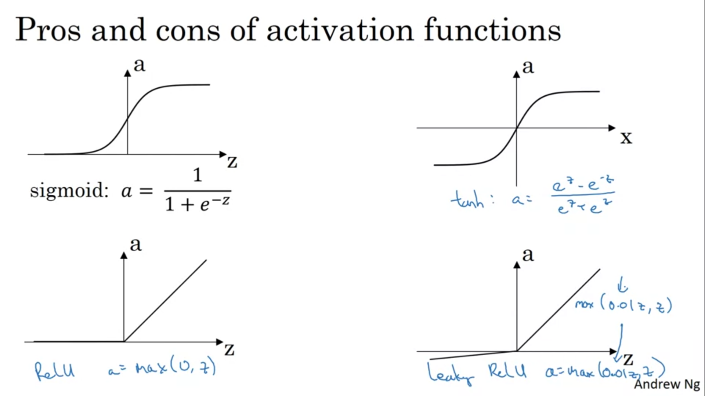

# 3rd Week - Neural Networks Basics

## Shallow Neural Networks

- You can stack layers of nodes to try improving your model.
- Using consecutive sigmoid calculations.
- Each node in the hidden layer has a diffent weight to each input and a bias.
- After going forward. We calculate the Loss function.
- Then, we backpropagate, finding the mistakes.
- Correct the weights. Repeat the process.

- You should vectorize your implementation to improve performance.

- Activation Functions
  - We can use a lot of different activation functions.
  - Use the sigmoid [Only better in binary classification in the output layer]
  - Use tanh (Centers your activation in 0) [Almost always superior]
  - ReLu (RectifierLinear Unit) [Uses a better slope for being more constant, the slope of the activation function is really different than 0]
  - Leaky ReLu is a ReLu but the negative z has a slope.
    
  - Linear activation function is rare because functions can get complex